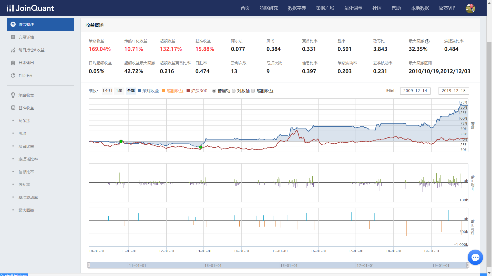

# Q4 基于聚宽平台实现一个随机入市策略

## 随机入市策略1

```python

# 简单起见只操作平安银行, 连续3日主力资金大比例流入且股价涨幅达到一定程度则全仓买入;
# 连续3日主力资金大比例流出且股价跌幅达到一定程度则清仓

# 导入函数库
from jqdata import *

# 初始化函数，设定基准等等
def initialize(context):
    # 定义一个全局变量, 保存要操作的股票
    # 000001(股票:平安银行)
    g.security = '000001.XSHE'
    g.action = ''

    # 设定沪深300作为基准
    set_benchmark('000300.XSHG')
    # 开启动态复权模式(真实价格)
    set_option('use_real_price', True)
    # 避免使用未来数据(避免data_leakage)
    set_option('avoid_future_data', True)

    ### 股票相关设定 ###
    # 股票类每笔交易时的手续费是：买入时佣金万分之三，卖出时佣金万分之三加千分之一印花税, 每笔交易佣金最低扣5块钱
    set_order_cost(OrderCost(close_tax=0.001, open_commission=0.0003, close_commission=0.0003, min_commission=5), type='stock')

    ## 运行函数（reference_security为运行时间的参考标的；传入的标的只做种类区分，因此传入'000300.XSHG'或'510300.XSHG'是一样的）
      # 开盘前运行
    run_daily(before_market_open, time='before_open', reference_security='000300.XSHG')
      # 开盘时或每分钟开始时运行
    run_daily(market_open, time='every_bar', reference_security='000300.XSHG')
      # 收盘后运行
    run_daily(after_market_close, time='after_close', reference_security='000300.XSHG')

def before_market_open(context):
    pass

def market_open(context):
    security = g.security
    if g.action == 'buy':
        # 取得当前的现金
        cash = context.portfolio.available_cash
        # 用所有 cash 买入股票
        order_value(security, cash)
        # 记录这次买入
        log.info("Buying %s" % (security))
    elif g.action == 'sell':
        # 卖出所有股票,使这只股票的最终持有量为0
        order_target(security, 0)
        # 记录这次卖出
        log.info("Selling %s" % (security))

    g.action = ''

# 每个单位时间(如果按天回测,则每天调用一次,如果按分钟,则每分钟调用一次)调用一次
def after_market_close(context):
    buy_count = 0
    sell_count = 0
    threshold = 3

    money_flow = get_money_flow(g.security, count=threshold, fields=['change_pct', 'net_pct_main'])
    for row in money_flow.itertuples(index=False):
        # 记录当日主力资金流向比例, 股价涨跌幅信息
        log.info('net_pct_main: {}, change_pct: {}'.format(row.net_pct_main, row.change_pct))
        if row.net_pct_main >= 5:
            if row.change_pct >= 0.5:
                buy_count += 1
        if row.net_pct_main <= -5:
            if row.change_pct <= -0.5:
                sell_count += 1

    # 连续N天满足条件则在第二天开盘时买入或卖出
    if buy_count == threshold:
        g.action = 'buy'
    elif sell_count == threshold:
        g.action = 'sell'

```

## 回测结果


